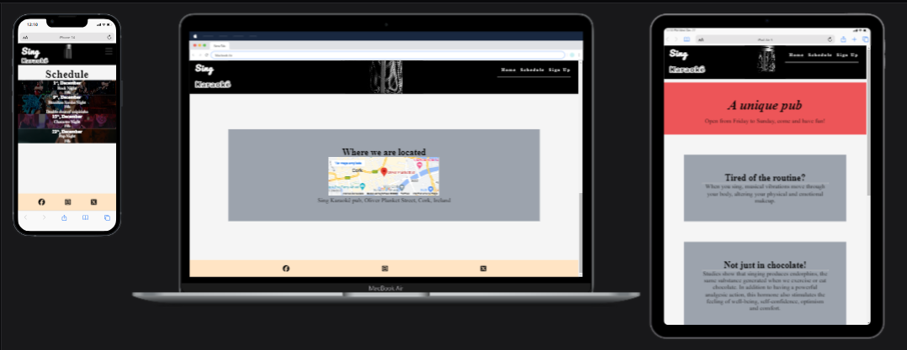

# Sing Karaokê

<hr>
Hello,
This website was developed as a first HTML and CSS project for the Diploma in Full Stack Software Development course by Code Institute.

## Layout

With a simple and intuitive layout with navigation menu with Home, Schedule and Sign Up pages. 
It was designed to have a responsive design for all types of devices.


## Technologies used:
 
- [Favicon.io](https://favicon.io/)
- [Pexel](https://www.pexels.com/)
## To run the project
To run a frontend (HTML, CSS, Javascript only) application in Codeanywhere, in the terminal, type:
```
python3 -m http.server
```
A button should appear to click: Open Preview or Open Browser.
## Author


[Linkedin](https://www.linkedin.com/in/marcelo-tavares-43a46b228/)