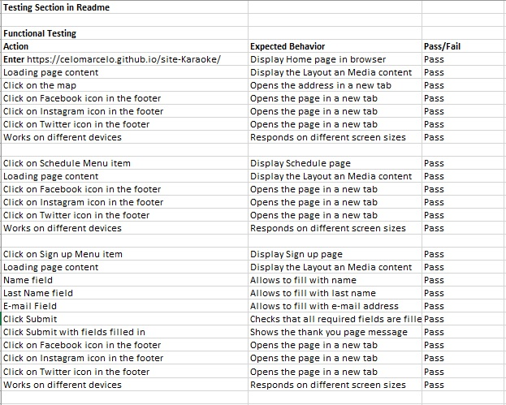

# Sing Karaokê

[Github-Pages](https://celomarcelo.github.io/site-Karaoke/)

[Github-Repository](https://github.com/Celomarcelo/site-Karaoke)

The Sing Karaoke website was created with the aim of being a website for people who like to sing in an amateur way, who like to enjoy their free moments with friends or family, who are looking for alternative entertainment.

## Features 

### Existing Features

- __Navigation Bar__

 - Featured on all three pages, the full responsive navigation bar includes links to the home page, schedule page, and registration and is identical on each page to allow for easy navigation.
  - This section will allow the user to easily intuitively navigate from one page to another on all devices without having to return to the previous page via the 'back' button.

- __The landing page image__

  - The landing includes a photograph with text overlay and a brief description about the website.

- __Information section__

  - The information section gives the user a little knowledge about the benefits of singing on the body.
  - It also has an address and a map to visualize the location

- __The Footer__ 

  - The footer section includes links to the relevant social media sites for Sing Karaokê. The links will open to a new tab to allow easy navigation for the user. 
  - The footer is valuable to the user as it encourages them to keep connected via social media

- __Schedule Page__

  - The agenda section provides a preview of events throughout the month, with a description of times and days.
  - It has illustrative images related to the event.

- __The Sign Up Page__

  - This section allows the user to register to stay up to date with events and take advantage of loyalty benefits such as points for euros spent at the establishment

### Features Left to Implement

- Survey form for regulars

## Testing 

### Validator Testing 

- HTML
  - No errors were returned when passing through the official [W3C validator](https://validator.w3.org/nu/?doc=https%3A%2F%2Fcelomarcelo.github.io%2Fsite-Karaoke%2Findex.html)
- CSS
  - No errors were found when passing through the official [(Jigsaw) validator](https://jigsaw.w3.org/css-validator/validator?uri=https%3A%2F%2Fcelomarcelo.github.io%2Fsite-Karaoke%2F&profile=css3svg&usermedium=all&warning=1&vextwarning=&lang=pt-BR)

### Chek List
- A feature checklist was created to ensure all testing.

### Lighthouse tests were carried out on all pages to ensure performance
- Home page

- Schedule Page

- Sign Up page

## Deployment

- The site was deployed to GitHub pages. The steps to deploy are as follows: 
  - In the GitHub repository, navigate to the Settings tab 
  - From the source section drop-down menu, select the Master Branch
  - Once the master branch has been selected, the page will be automatically refreshed with a detailed ribbon display to indicate the successful deployment. 

The live link can be found here - https://celomarcelo.github.io/site-Karaoke/ 

## Credits 

### Content 
- 
- The text content was extracted from the following pages:
  - Canto do Batuque escola de música 
  - Escola Nosso Canto
  - Site Puc Sp
- The code for implementing the iframe was extracted from Google maps
- The icons in the footer were taken from [Font Awesome](https://fontawesome.com/)
### Media
- The images used were taken from the Pexels website [Pexels](https://www.pexels.com)
 